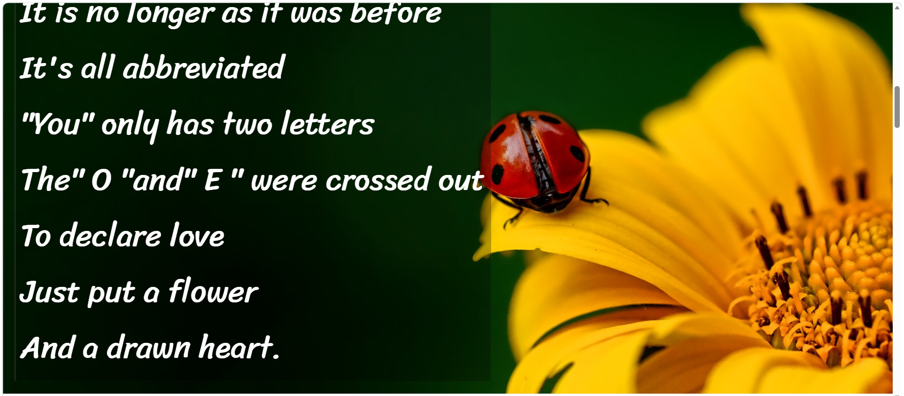

# Moderna Cordel - Poesia e Tecnologia

## 📖 Sobre o Projeto

"Moderna Cordel" é uma página web que apresenta um poema de cordel moderno de **Milton Duarte**, abordando a relação entre tecnologia e comunicação humana. O projeto destaca-se pelo uso de **efeitos de parallax** com backgrounds dinâmicos e fixos, criando uma experiência imersiva enquanto o usuário rola a página.

---

## 🎨 Características Visuais

### Background Dinâmico e Fixo (Parallax Effect)
O projeto utiliza **imagens de fundo fixas** que permanecem estáticas enquanto o conteúdo rola sobre elas, criando um efeito visual impactante:

| Seção | Efeito | Descrição |
|-------|--------|-----------|
| **Seções normais** (`s1`) | Fundo sólido branco | Texto legível sobre fundo limpo |
| **Seções com foto** (`foto1` e `foto2`) | **Background fixo** | Imagem de fundo com efeito parallax, criando profundidade visual |

### Estrutura Visual
- **Header**: Título centralizado com link para o autor
- **Seções alternadas**: Texto em fundo branco e texto sobre imagens com parallax
- **Footer**: Créditos com data de criação

---

## 🖼️ Exemplo Visual do Efeito Parallax

| Dispositivo | Visualização |
|-------------|--------------|
| **Desktop** |  | |
| **Mobile** |  |

> As imagens de fundo permanecem fixas enquanto o texto se move sobre elas, criando o efeito característico de parallax.

---

## 📝 Conteúdo do Poema

O poema "Moderna Cordel" de Milton Duarte aborda temas como:

- **Crítica à tecnologia**: Comunicação fria e abreviada (e-mail, Twitter, Facebook)
- **Nostalgia**: Saudade das cartas escritas à mão
- **Emojis e abreviações**: Como símbolos substituíram palavras
- **Reflexão final**: A tecnologia não substitui a fé e a conexão espiritual

### Versos em Destaque

> *"I'm getting tired*  
> *Of such technology*  
> *We only talk by email*  
> *Short and cold message"*

---

## 🛠️ Tecnologias Utilizadas

- **HTML5**: Estrutura semântica
- **CSS3**: Estilização com efeitos de parallax
- **Design Responsivo**: Adaptação para diferentes dispositivos

### Efeitos CSS Principais
```css
/* Exemplo do efeito de background fixo */
.foto {
    background-attachment: fixed;
    background-size: cover;
    background-position: center;
}